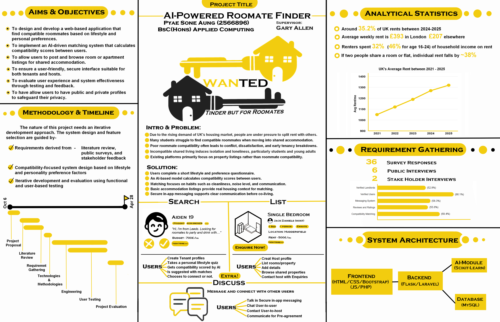

<p align="center">
  
</p>

# WANTED — Flatmate Compatibility and Accommodation Platform

WANTED is a final-year university web application for discovering potential flatmates and accommodation through questionnaire-based lifestyle compatibility, matching, messaging and listings.

This repository contains the completed original version of WANTED, built as a BSc Applied Computing project by Pyae Sone Aung (Mitch). It is a local-development portfolio project rather than a production accommodation service. A separate WANTED V2 effort is planned for deeper refactoring, stronger test coverage and architecture improvements; those changes are intentionally outside this original repository.

## Demo and Portfolio Materials

Supporting portfolio materials are included in the [Demo](Demo/) folder:

| Material | Path |
| --- | --- |
| Full demo video | [Demo/FullDemo.mov](Demo/FullDemo.mov) |
| Screenshots | [Demo/Screenshots](Demo/Screenshots/) |
| Activity diagrams | [Demo/Activity Diagrams](<Demo/Activity Diagrams/>) |
| Poster | [Demo/Poster.png](Demo/Poster.png) |
| Slideshow | [Demo/SlideShow.pptx](Demo/SlideShow.pptx) |

These assets are evidence from the completed university project. They are kept separate from the application source so the repository remains easy to browse.

## Overview

Conventional accommodation searches often show rent, location and property details, but give limited help with the day-to-day question of whether people might actually live well together. WANTED combines profile information, budget and location data, lifestyle preferences and accommodation listings so users can move from discovery to communication with more structure.

The primary compatibility path is deterministic and questionnaire-based. Users complete a multi-stage onboarding flow, the application stores their latest quiz responses, and a rule-based scorer produces a 0-100 compatibility score. That score is used in the Discover experience alongside filtering, sorting, Like/Pass decisions and Second Chance behaviour. The score is an application signal, not a guarantee of a successful flatmate relationship.

The repository also includes experimental AI features. A Gemini-assisted profile-bio feature helps users draft short bios from their own profile and quiz information. A separate Flask/scikit-learn compatibility service can be used as an optional beta mode, but it is trained from limited project data and should not be presented as a mature recommendation system or a proven compatibility model.

## Verified Features

### Account and Onboarding

The application includes custom registration and login controllers, Laravel authentication, reCAPTCHA verification during registration, and a four-step quiz wizard. Registration creates a user plus initial public and private profile rows. The onboarding middleware checks whether the authenticated user has quiz responses before allowing the main discovery flow.

### Compatibility and Discovery

WANTED stores questionnaire responses and computes compatibility rows for pairs of users. The rule-based score compares looking-for type, city, budget range overlap or distance, hobbies and lifestyle preferences. Discover reads those compatibility rows, joins profile information and gallery photos, and supports normal compatibility ordering plus filters such as city, age range, budget range and looking-for type. Users can also revisit passed profiles through the Second Chance mode.

### Matching and Private Messaging

Users can Like or Pass profiles. When two users like each other, the swipe flow creates a mutual match and the inbox flow ensures a conversation thread exists. Messaging is stored in application tables, and matched users can toggle private-information sharing from the inbox. Unmatching removes the match, messages and inbox thread for that pair.

### Profiles and Privacy Controls

The profile area separates public profile data, private living-preference data and photo uploads. Users can update display information, bio, city and budget range; maintain private profile fields such as sleep schedule, guest policy, working hours, room preference and noise tolerance; and upload or delete profile photos through the public storage disk.

### Accommodation Listings and Enquiries

Listings can be browsed, filtered, created, edited, soft-deleted from the owner view and linked to uploaded property photos. Users can enquire about a listing, which creates a listing-specific inbox thread and message. Listing owners can view and reply to enquiries from their own listing-management area.

### AI-Assisted and Experimental Functionality

The profile page can call a Laravel endpoint that sends selected profile and quiz facts to the Gemini API and returns a short suggested bio. The Discover controller also contains an AI beta path that can call a local Flask scorer using `AI_SCORER_URL` and store returned probability-derived scores in `ai_compatibility`. The Flask service is optional and loads `model.joblib` from its own service directory.

## Technology Stack

| Area | Verified technology | Evidence and notes |
| --- | --- | --- |
| Backend | PHP 8.2+, Laravel 12.51.0, Blade | `composer.json`, `composer.lock`, controllers, middleware and Blade views |
| Database | MySQL-oriented relational application schema | Query builder code expects custom WANTED tables; checked-in migrations are incomplete |
| Frontend | HTML, CSS, JavaScript and Bootstrap 5.3.3 | Main Blade layouts and auth/quiz views load Bootstrap from a CDN and include page scripts |
| Asset tooling | npm, Vite and Tailwind configuration | `package.json`, `vite.config.js` and `resources/css/app.css` are present, although much UI styling is inline in Blade |
| AI bio assistance | Gemini API via Laravel HTTP client | `AiBioController` uses `GEMINI_API_KEY` and `GEMINI_MODEL` |
| Experimental ML | Python, Flask, pandas, NumPy, scikit-learn and joblib | `ai/wanted_ai_service/app.py`, training script and requirements files |
| Development tooling | Composer, npm/Vite, Laravel dev server and XAMPP-style local hosting | Repository lives as a local Laravel/XAMPP project and supports `php artisan serve` |

## Project Structure

```text
app/
  Console/Commands/        Compatibility-related Artisan command code
  Http/Controllers/        Auth, quiz, discover, swipe, inbox, profile and listing flows
  Http/Middleware/         Quiz-completion gate for the main application
  Models/                  User, public/private profile and quiz model classes
  services/                Rule-based compatibility scorer and storage helper
ai/
  wanted_ai/               Training script, dataset and training-side model artifact
  wanted_ai_service/       Optional Flask prediction service and service-side model artifact
database/
  migrations/              Laravel starter migrations only; not the full WANTED schema
resources/
  views/                   Blade screens and layouts
routes/
  web.php                  Browser routes
  console.php              Console route command for compatibility computation
tests/
  Feature/, Unit/          Starter smoke/example tests
```

The local Python virtual environment under `ai/wanted_ai/.venv/` is intentionally not part of this source tree. Recreate environments from requirements files instead of committing installed dependencies.

## Setup

These instructions are for a fresh local development clone. Do not use real production secrets in `.env`, and do not reuse another developer's existing application key.

### Prerequisites

- PHP 8.2 or newer.
- Composer.
- MySQL or MariaDB.
- Node.js and npm compatible with the Vite version in `package.json`.
- Python 3.11 is the known local development version for the experimental ML environment.
- XAMPP can be used as a convenient local PHP/MySQL stack, but Laravel's built-in server is also suitable.

### Laravel Application

```bash
git clone https://github.com/pyaesoneaungmitch/wanted-flatmate-matching-platform.git
cd wanted-flatmate-matching-platform
composer install
cp .env.example .env
php artisan key:generate
```

Configure MySQL in `.env` using local placeholder values such as:

```env
DB_CONNECTION=mysql
DB_HOST=127.0.0.1
DB_PORT=3306
DB_DATABASE=wanted_local
DB_USERNAME=root
DB_PASSWORD=
```

Registration calls Google's reCAPTCHA verification endpoint through `RECAPTCHA_SECRET`. Use your own development reCAPTCHA secret in `.env` when testing registration locally.

The application stores uploaded profile and listing photos on Laravel's public disk. For local serving, create the storage link after the application is configured:

```bash
php artisan storage:link
```

Install and build frontend assets when needed:

```bash
npm install
npm run build
```

For local development, run:

```bash
php artisan serve
```

With XAMPP, an alternative is to place the project under the Apache document root and configure Apache/PHP/MySQL normally for a Laravel project. The application entry point remains `public/index.php`.

### Database Setup Status

The checked-in migrations are not a complete WANTED schema. The current code expects custom columns and tables such as `users.user_id`, `users.password_hash`, `username`, `public_profile`, `private_profile`, `quiz_responses`, `compatibility`, `ai_compatibility`, `swipes`, `matches`, `inbox`, `messages`, `gallery`, `listings` and `property_photos`. The starter users migration still creates Laravel's default `id` and `password` columns, so `php artisan migrate` alone is not enough to create a working WANTED database.

To make a fresh clone fully reproducible, this repository needs either complete WANTED migrations or a sanitised schema-only export. Until that artifact is added, database setup requires an existing compatible local schema. Avoid destructive migration commands such as `migrate:fresh`, `migrate:refresh` or database wipes against a working database.

### Optional Gemini Bio Generation

The AI bio generator is optional. Add these environment variables only when you have your own Gemini API credentials:

```env
GEMINI_API_KEY=
GEMINI_MODEL=gemini-2.5-flash
```

The application should be able to run without this key, but the Generate bio feature will return a configuration error until a valid key is supplied.

### Optional Experimental Flask Compatibility Service

The rule-based scorer is the normal application path. The Flask service is optional beta functionality for local experimentation.

```bash
cd ai/wanted_ai_service
python -m venv .venv
python -m pip install -r requirements.txt
python app.py
```

The service loads `model.joblib` from `ai/wanted_ai_service/` and serves predictions at `http://127.0.0.1:5005/predict`. The training script in `ai/wanted_ai/` reads `v_ai_dataset.csv` and writes a training-side `model.joblib`. The two model files are kept in their current locations because the scripts use relative paths.

To point Laravel at the local beta service:

```env
AI_SCORER_URL=http://127.0.0.1:5005/predict
AI_MATCH_THRESHOLD=0.5
```

## Usage Flow

1. Register or log in.
2. Complete the onboarding quiz.
3. Review Discover recommendations and apply filters.
4. Like or Pass profiles; use Second Chance to revisit passed profiles.
5. Open mutual matches in the inbox and exchange messages.
6. Share or stop sharing private information with matched users.
7. Browse accommodation listings or create/manage your own listing.
8. Send and reply to listing enquiries.
9. Edit profile details, bio and photos from the profile area.

## Testing and Verification

The repository includes Laravel's default PHPUnit structure and starter example tests. These are useful as smoke checks, but they do not cover the main WANTED workflows such as onboarding, compatibility scoring, matching, messaging or listing enquiries.

When dependencies and an isolated test database are available, useful checks include:

```bash
composer validate
php artisan test
php artisan route:list
```

Do not run tests or migrations against a personal working database unless the environment is intentionally isolated.

## Current Limitations

- The complete WANTED database schema is not yet reproduced as checked-in migrations.
- Automated tests are currently starter-level and do not provide business-flow coverage.
- The Flask/scikit-learn compatibility service is experimental and based on limited project data.
- The project is documented for local development and portfolio review, not production deployment.
- Some technical cleanup remains intentionally deferred, including duplicate route declarations, service-directory casing and AI model-path consolidation.

## Ongoing Development

WANTED V2 is a separate refactoring effort focused on maintainability, testing, architecture and reproducible setup. This repository preserves the original completed university version while making it easier for recruiters and developers to understand what was built and what remains to be improved.
